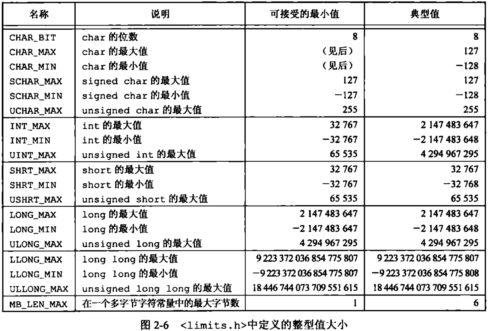

# Unix基础知识

从这篇文章开始记录学习《Unix环境高级编程》这本书的一些知识点。
后面在结合《深入理解操作系统原理》一起，系统的学习系统应用的开发

> 第三次系统回顾《APUE》这本书
> 第四次系统回顾《APUE》这本书

<!--more-->

## Unix体系结构

所有的操作系统都为他们所运行的程序提供服务，最典型的服务器包括：**执行新程序、打开文件、读文件、分配存储空间以及获取当前时间**等等。
操作系统可以定义为一种软件，它控制着计算的硬件资源，提供程序运行环境。
因为操作系统这种软件比较小，而且位于环境的核心，所以我们称之为内核。


* 内核提供的接口被称为**系统调用（system call）**
* 公用函数库建立在系统调用结构之上，应用程序即可以使用公用函数库，也可以使用系统调用
* `shell`是一个特殊的应用程序，为运行其他应用程序提供了一个接口

## 登录

系统的口令文件通常是 `/etc/passwd`文件。口令文件中的登录项由7个冒号分割的字段组成，一次是：

1. 登录名
2. 加密口令
3. 数字用户ID
4. 数字组ID
5. 注视字段
6. 起始目录
7. `shell`程序

目前所有的系统已经将加密口令移到另一个文件中，所以你看到的可能是一个 `*`。

## 文件和目录
* Unix文件系统是目录和文件的一种层次结构，所有的东西的起点是称为根的目录 -- `/`
* **目录是一个包含目录项的文件**
* 以斜线开头的路径名称为绝对路径名，否则称为相对路径名。

## 输入输出

不带缓冲的IO函数：`open`、`read`、`write`、`lseek`、`close`
标准IO：
1. 为不带缓冲的IO函数提供一个带缓冲的接口。
2. 无需担心如何选取最佳的缓冲区大小
3. 简化了对输入行的处理

**IO操作是unix环境编程的重点之一**

## 程序和进程

1. 程序的执行实例被称为进程。UNIX系统确保每个进程都有一个唯一的数字标识符，称为进程ID，进程ID总是一个**非负整数**
2. 有三个用于进程控制的函数：`fork`、`exec`和`waitpid`。(exec函数有7种变体，但是经常统称为exec函数)
3. 线程是指进程中某一时刻执行的一组机器指令，通常一个进程只有一个控制线程。
   * 进程内的所有线程共享同一地址空间、文件描述符、栈以及与进程相关的属性。
   * 因为线程可以访问同一存储区，所有在处理多线程问题时要注意共享数据的同步问题
   * 同进程一样线程也有ID标识。但是线程ID只在它所属的进程中有效。

## 出错处理

1. 当Unix系统函数出错时，通常会返回一个负值，而且整型变量`errno`通常被设置为具有特定信息的值。
2. 有些函数对于出错则使用另一种约定而不是返回负值。例如，大多数返回对象指针的函数，出错时通常返回`NULL`指针
3. 文件`<errno.h>`中定义了`errno`以及可以赋予它的各种常量。
4. 在支持线程的环境中，每个线程都有属于它自己的局部`errno`，以避免一个线程干扰另一个线程
5. 对于`errno`要注意两条规则：
   * 如果没有出错，其值不会被例程清除。因此仅当函数的返回值明确指出错误时，才检测其值
   * 任何函数都不会将`errno`值设置为0，而且在`errno.h`中定义的所有常量都不为0
6. c标准定义了两个函数，用于打印出错信息

   ```c
   #include <string.h>
   // 用于将errnum(通常是errno)映射为一个出错信息字符串，并返回字符串指针
   char *strerror(int errnum);
   
   #include <stdio.h>
   // 给予errno当前值，在标准错误上产生一条出错信息，并返回
   void perror(const char *msg); // 先打印参数msg然后加一个冒号和一个空格，然后是errno对应的错误信息，最后是一个换行符
   ```

7. `errno.h`中定义的各种出错分为两类：

   * 致命性错误：无法执行恢复动作，最多打印一条出错信息写入日志文件中
   * 非致命性错误：有时可以经过妥善的处理让程序恢复运行。大多数非致命性错误都是暂时的
     * 常用的处理方式是延时一会儿再执行

## 用户标识

1. 口令文件登录项中的用户ID是一个数值，它指向系统标识各个不同的用户。
2. 用户ID不能修改。
3. 如果是root用户，大多数文件权限检测都不再进行
4. 口令文件登录项中也包括用户的组ID，它也是一个数值。这种机制允许同组的各个成员间共享资源
5. 组文件将组名映射为数值的组ID，组文件通常是`/etc/group`
6. 在磁盘上的文件，文件系统都会存储该文件所有者的用户ID和组ID。存储这两个值只需要4个字节
7. 从`4.2BSD`开始就支持了一个用户属于多个组，统称为附属组

## 信号

1. 信号用于通知进程发生了某种情况
2. 进程处理信号的三种方式：
   * 忽略信号：有些信号标识硬件异常，它们会产生不确定的后果，所以不推荐使用这种处理方式
   * 按系统默认方式处理。
   * 捕捉信号：提供一个自编的信号处理函数，对信号进行处理。这样做可以按照我们期望的方式来处理信号
3. 在键盘上有两种方式产生信号，他们都是用于中断当前运行的进程：
   * 中断键`(ctrl + c)`
   * 退出键`(ctrl + \)`
4. 还有一种方式可以产生信号，就是调用`kill`函数。在一个进程中调用此函数可以给另一个进程发送信号，但是这样做是有限制的：**我们必须是接收信号进程的所有者或者超级用户**

## 时间值

1. UNIX系统使用两种不同的时间值：
   * 日历时间：`UTC`时间`(1970年1月1日 00:00:00开始，距今的秒数)`。这种时间用于记录文件最近一次的修改时间等等。系统基本数据类型`time_t`用来保存这种时间值
   * 进程时间：`CPU`时间。用来度量进程使用的中央处理器资源。进程时间是以时钟滴答（用`syscon`获取）计算。系统基本数据类型`clock_t`用来保存这一时间值
2. 当度量一个进程的执行时间时，Unix系统维护了三个进程时间值:
   * 时钟时间：它是进程运行的时间总量，其值与系统中同时运行的进程数有关。
   * 用户CPU时间：是指执行用户指令所用的时间量
   * 系统CPU时间：是指该进程执行内核程序所经过的时间
3. 用户CPU时间和系统CPU时间统称为CPU时间

## 系统调用和库函数

1. 各个版本的UNIX实现都提供良好定义、数量有限、直接进入内核的入口点，这些入口点被称为系统调用
2. UNIX为每个系统调用在标准C库中设置一个具有相同名字的函数。用户调用该函数，然后该函数又用系统所要求的技术调用相应的内核服务
3. 系统调用一般在`man`手册的**第2部分**
4. 通用库函数：这些函数与系统函数差不多，它们会调用一个或多个内核的系统调用，但它们并不是内核的入口点。
5. 通用库函数一般在`man`手册的**第3部分**
6. 对于实现者的角度来看系统调用和库函数有根本区别，但是从用户的角度来看这两者的区别并不重要。
7. 系统调用和库函数之间的差别：
   * 如果可能的话，我们可以替换库函数，但是我们却无法替换系统调用。
   * 系统调用通常提供一种最小接口，而库函数通常提供比较复杂的功能

# UNIX标准及实现

## ISO C

> ISO C标准的意图是提供C程序的可移植性，使其能适合于大量不同的操作系统，而不是只适合UNIX系统

* 此标准不仅定义了C程序设计语言的语法和语义，还定义了其**标准库**
* 1999年增加了 `restrict`关键字，用于告诉编译器那些指针引用是可以优化的。该版本还显著改善了对进行数值处理的应用软件的支持

ISO C标准定义的头文件如图


## POSIX

> POSIX指的是可移植操作系统接口（Portable Operation System Interface）

* 该标准的目的是提升应用程序在各种UNIX系统环境之间的可移植性

POSIX指定的头文件有：


## Single UNIX Specification

> Single UNIX Specification（SUS，单一UNIX规范）是POSIX标准的一个超集，他定义了一些附加接口，扩展了POSIX规范提供的功能。
>
> 一个系统想要称为UNIX系统，其实现必须支持SUS定义的这些接口

## 限制

> UNIX系统实现定义了很多幻数和常量，其中有很多已被硬编码到程序中，或用特定的技术确定。

以下两种类型限制是必须的：

1. 编译时限制（例如，短整形的最大值是什么？）
2. 运行时限制（例如，文件名有多少个字符？）

编译时限制可在头文件中定义。程序在编译时可以包含这些头文件。

运行时限制则要求进程调用一个函数获得限制值

> 有些限制在一个给定的实现中可能是固定的，但是在另一个实现中则可能是变动的。例如，文件名的长度
>
> 为了解决这类问题，提供三种限制：
>
> 1. 编译时限制（头文件）
> 2. 与文件或目录无关的运行时限制（sysconf函数）
> 3. 与文件或目录有关的运行时限制（pathconf和fpathconf函数）

### ISO限制

>  ISO C定义的所有编译时限制都列在头文件 `<limits.h>`中
>
> 在头文件 `<float.h>`中，对浮点数据类型也有类似的定义。



### POSIX限制

> POSIX定义了很多设计操作系统实现限制的常量。与POSIX接口相关的限制和常量分为7类：
>
> 1. 数值限制：LONG_BIT、SSIZE_MAX和WORD_BIT
> 2. 最小值
> 3. 最大值
> 4. 运行时可以增加的值
> 5. 运行时不变的值
> 6. 其他不变值
> 7. 路径名可变值

### XSI限制

> XSI定义了代表实现限制的几个常量：
>
> 1. 最小值：见下图
> 2. 运行时不变值：IOV_MAX和PAGE_SIZE


### 获取运行时限制值的函数

```c++
#include <unistd.h>
long sysconf(int name);

long pathconf(const char *pathname, int name);
long fpathconf(int fd,int name);
// 所以函数返回值：若成功，返回相应的限制值；若出错，返回-1
// 如果参数输出无效的，则函数返回-1，并设置errno为EINVAL
// 如果参数是不确定的，则函数返回-1，并不设置errno
```


## 常用的基本系统数据类型


